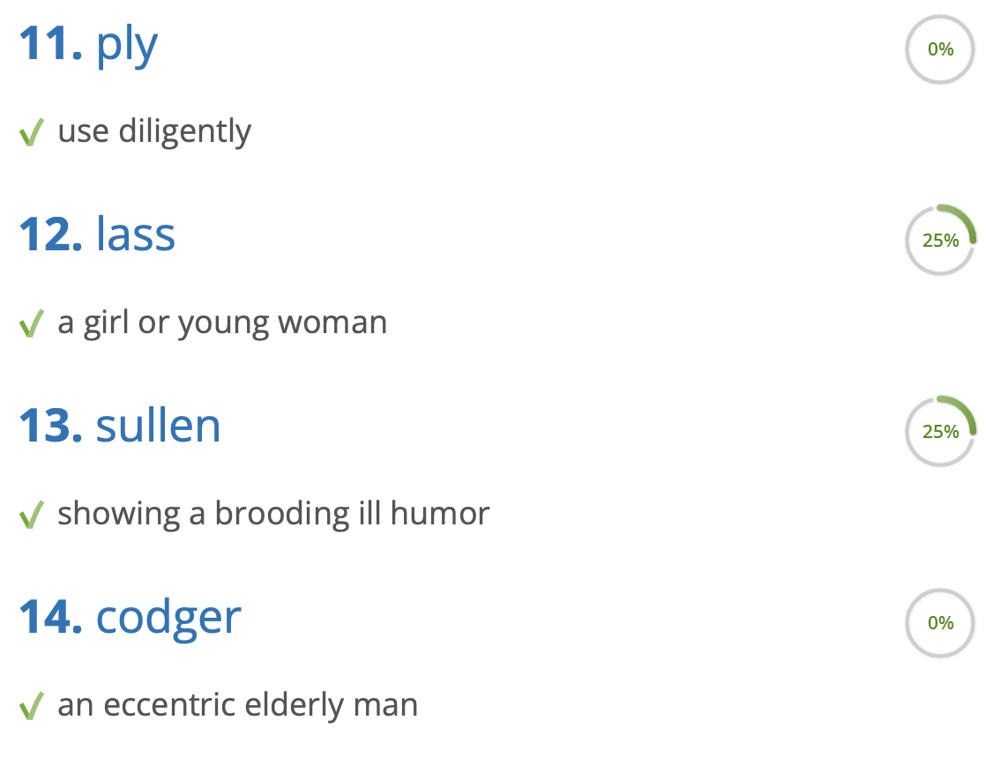

# SRT2vocabulary

Script for converting subtitles in SRT format to a wordlist.

The purpose of this is to get new vocabulary to learn from series I watch.

The idea is to get a small list of uncommon words that can be redacted manually and used
for learning the unknown words in a tool like [vocabulary.com](https://www.vocabulary.com/).



### Example Usage

```
src/main.py samples/The.Witcher.S02E01.srt common_words/30k.txt samples/witcher_words.txt
```

---

Most common English words lists from https://github.com/derekchuank/high-frequency-vocabulary
